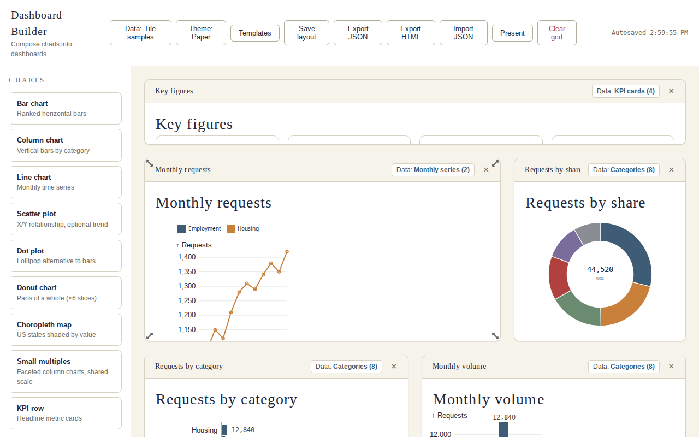
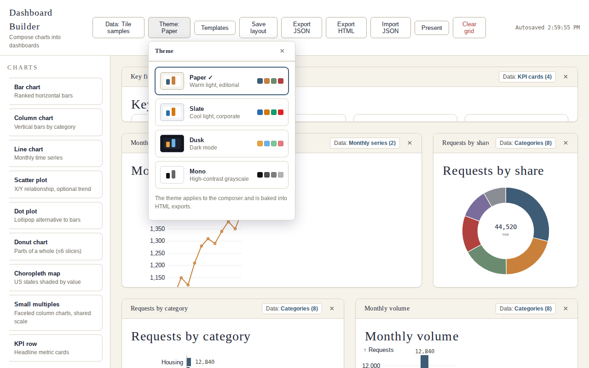

# Dashboard Builder

A free, open-source, drag-and-drop dashboard composer. Pick chart types from
a palette, drop them onto a 12-column grid, resize them, bind data, and export
a self-contained HTML dashboard — a Tableau/PowerBI-style workflow with no
subscription, no server, and no account. Charts are
[Observable Plot](https://observablehq.com/plot/)-based components rendered
through a small internal chart kit, styled by one of four selectable themes.



## Features

- **Drag-and-drop composer** — palette of 9 chart types (bar, column, line,
  scatter, dot, donut, choropleth, small multiples, KPI row), 12-column
  GridStack grid, drag/resize, present mode.
- **Four selectable themes** — Paper (warm light), Slate (cool corporate),
  Dusk (dark), Mono (high-contrast grayscale). Themes drive the app chrome
  *and* every chart's colors, fonts, and gridlines; the choice persists across
  sessions and travels with exported files.
- **Data binding per tile** — bundled sample datasets, CSV/JSON uploads with
  column mapping, or in-browser DuckDB SQL over every registered table.
  A dashboard-wide default dataset with per-tile overrides.
- **Template gallery** — six starter dashboards (executive overview, sales,
  marketing, operations, nonprofit program, regional map) plus user-saved
  templates, applied with one click.
- **Static HTML export** — one self-contained `.html` dashboard (inlined
  JS/CSS/data, baked theme, no runtime network calls) for sharing or hosting.
- **Layout JSON** — autosave, explicit save, export/import with self-contained
  inlined datasets and queries.
- **Fully local** — no runtime network calls, no telemetry, no analytics.
  The network is touched only by `npm install` at build time.

## Stack and licenses

| Dependency | Version | License | Role |
|---|---|---|---|
| [gridstack](https://github.com/gridstack/gridstack.js) | 13.x | MIT | Drag/resize dashboard grid |
| [@observablehq/plot](https://github.com/observablehq/plot) | 0.6.x | ISC | Chart rendering |
| [d3-shape](https://github.com/d3/d3-shape) | 3.x | ISC | Donut arcs |
| [d3-interpolate](https://github.com/d3/d3-interpolate) | 3.x | ISC | Color ramps |
| [htl](https://github.com/observablehq/htl) | 0.3.x | ISC | HTML/SVG templating |
| [d3-dsv](https://github.com/d3-dsv) | 3.x | ISC | CSV parsing for uploads |
| [@duckdb/duckdb-wasm](https://github.com/duckdb/duckdb-wasm) | 1.32.0 | MIT | In-browser SQL, lazy-loaded |
| [topojson-client](https://github.com/topojson/topojson-client) | 3.x | ISC | TopoJSON → GeoJSON (choropleth) |
| [idb](https://github.com/jakearchibald/idb) | 8.x | ISC | IndexedDB wrapper (upload store) |
| [vite](https://vite.dev/) (dev) | 7.x | MIT | Build tooling |

This project itself is **MIT** (see `LICENSE`). Every third-party dependency
is under a permissive license (MIT / ISC / Apache-2.0 / BSD-3-Clause /
Unlicense / 0BSD) — verified with
`npx -y license-checker --summary` (2026-10-01).

## Getting started

```bash
npm install
npm run dev      # local dev server with hot reload
npm run build    # static production build -> dist/ (two-stage: export template, then app)
npm run preview  # preview the production build
```

`dist/` is a plain static site: host it anywhere (GitHub Pages, Netlify, S3…).

## Themes

The theme button in the header (next to **Data**) opens a picker with a
preview swatch for each theme. Switching a theme re-renders every chart on the
dashboard immediately.

| Theme | Feel | Good for |
|---|---|---|
| **Paper** (default) | Warm light, editorial | General-purpose, print-friendly |
| **Slate** | Cool light, corporate | Business decks, reports |
| **Dusk** | Dark mode | Embedded displays, night viewing |
| **Mono** | High-contrast grayscale | Accessibility, fax-era resilience |

Themes are defined in `src/themes/themes.js` as a single object per theme:
CSS custom properties for the app chrome, concrete chart tokens (ink, grid,
accents) and categorical/sequential palettes, and system-only font stacks.
**Adding a theme:** add an entry to `THEMES` — the picker, persistence,
layout, and export paths pick it up automatically.



## Project structure

```
dashboard-builder/
├── index.html                  # App shell: header, palette aside, grid main
├── vite.config.js              # App build
├── vite.export.config.js       # Static-export template build (library mode)
├── LICENSE                     # MIT, Nate Riera
├── README.md
└── src/
    ├── main.js                 # Composer logic: grid, palette, tiles, persistence
    ├── style.css               # App chrome driven by theme CSS variables
    ├── themes/
    │   └── themes.js           # THEMES (paper/slate/dusk/mono), get/set/apply
    ├── charts/
    │   ├── charts.js           # Theme-aware chart kit: bar, column, line,
    │   │                       #   scatter, dot, donut, choropleth,
    │   │                       #   small multiples, KPI row, card wrapper
    │   └── format.js           # Number/date formatters used by the kit
    ├── data/                   # Sample datasets (JSON) + upload pipeline
    │   ├── categorical.json    # labeled values -> bar/column/dot/donut
    │   ├── timeseries.json     # monthly x 2 series -> line
    │   ├── scatter.json        # x/y/group -> scatter
    │   ├── kpis.json           # headline cards -> KPI row
    │   ├── states.json         # sample per-state values (FIPS ids) -> choropleth
    │   ├── facets.json         # sample 3 facets × 5 categories -> small multiples
    │   ├── us-states-10m.json  # TopoJSON topology rendered by the choropleth
    │   ├── parse.js            # CSV (d3-dsv) / JSON file parsing + validation
    │   ├── store.js            # Uploaded-dataset store (memory + IndexedDB)
    │   ├── queries.js          # Saved SQL queries (immutable, per-apply ids)
    │   └── duckdb.js           # DuckDB-WASM loader, table sync, query runner
    ├── tiles/
    │   ├── registry.js         # Tile catalog: one entry per chart type
    │   └── normalize.js        # Pure upload helpers: field mapping, coercion
    ├── ui/
    │   ├── dataPopover.js      # Tile "Data" popover (Samples / Upload / SQL)
    │   ├── dashboardDataPopover.js  # Header "Data" popover (dashboard default)
    │   ├── themePopover.js     # Theme picker popover
    │   └── templates.js        # Template gallery UI
    ├── templates.js            # Built-in + user template definitions
    └── export/
        ├── main.js             # Standalone viewer rendered into dashboard.html
        ├── style.css           # Export chrome (theme variables, fallbacks)
        └── export.js           # Layout → self-contained HTML generator
```

## How tiles work

`src/tiles/registry.js` maps a tile `type` to everything the composer needs:

```js
bar: {
  label: "Bar chart",
  description: "Ranked horizontal bars",
  datasets: ["categorical"],     // dataset keys this tile can render
  defaultDataset: "categorical",
  defaultSize: { w: 6, h: 5 },   // GridStack size for a fresh tile
  defaultTitle: "Requests by category",
  controls: [ ... ],             // optional extra toolbar controls
  render(el, { data, options }) { /* mount chart into el */ }
}
```

`render(el, {data, options})` measures `el.clientWidth`, calls the theme-aware
kit function with that width, and wraps the result in `card()` with the tile's
title and source line. Tiles re-render on GridStack `resizestop`, so charts
stay crisp at their grid size — and re-render on theme change, so chart
colors, gridlines, and labels follow the active theme. Each tile's toolbar
offers an editable title, a **Data** button (samples / CSV/JSON upload / SQL —
see *Data binding*), and a remove button; tiles are dragged by their toolbar
so chart tooltips keep working.

**Adding a chart type:** add a theme-aware kit function (or any
`(data, opts) => DOM node` renderer that reads `getTheme()`), register it in
`TILE_TYPES`, and it appears in the palette — no other wiring needed.

## How layout JSON works

A layout is a plain JSON document:

```json
{
  "app": "dashboard-builder",
  "version": 1,
  "theme": "paper",
  "savedAt": "2026-10-01T16:00:00.000Z",
  "tiles": [
    {
      "id": "tile-m3abc-0",
      "type": "bar",
      "title": "Requests by category",
      "source": "Sample data",
      "dataset": "categorical",
      "tileOptions": {},
      "x": 0, "y": 2, "w": 6, "h": 5
    }
  ]
}
```

- Geometry (`x/y/w/h`) comes from `grid.save()`; everything else is tile
  metadata keyed by widget id. `dataset` is a sample key (`"categorical"`),
  an upload reference (`"upload:<id>"`), or a query reference (`"query:<id>"`).
  `theme` records the active theme; importing a layout applies its theme.
- **Autosave:** the layout is written to `localStorage`
  (`dashboard-builder:layout:v1`) on every grid change (debounced) and
  restored on startup. Uploaded datasets persist in IndexedDB
  (`dashbuilder`, object store `datasets`), separate from the layout, so the
  autosaved layout never balloons. A starter dashboard loads on first run.
- **Save layout** writes explicitly; **Export JSON** downloads the file
  (inlining referenced uploads under 500KB and queries so it's self-contained);
  **Import JSON** loads one (unknown tile types are rejected with an error;
  inlined datasets and queries are restored). Layouts saved before the theme
  era (no `theme` field) load with the default Paper theme.

### Storage migration

Storage keys were renamed to brand-neutral names; the app migrates once on
startup and then drops the old keys, so existing users keep their data:

| Content | Current | Legacy (migrated) |
|---|---|---|
| Uploaded datasets (localStorage → IndexedDB) | `dashbuilder` DB | `klaroDash.datasets.v1`, `klaro-dashboard` DB |
| Saved SQL queries | `dashbuilder.queries.v1` | `klaroDash.queries.v1` |
| User templates | `dashbuilder.templates.v1` | `klaroDash.templates.v1` |
| Theme | `dashbuilder.theme.v1` | `klaroDash.theme.v1` |
| Layout autosave | `dashboard-builder:layout:v1` | — (unchanged) |

## Data binding

Each tile type declares the data it needs in a `fields` array in
`src/tiles/registry.js` (e.g. `{key:'value', label:'Value column', numeric:true}`).
The upload UI is driven entirely by these declarations — adding a chart type
with its own fields needs no UI changes.

| Tile | Fields |
|---|---|
| Bar, Column, Dot, Donut | Label column; Value column (numbers) |
| Line | X column — dates (`YYYY-MM`/`YYYY-MM-DD` become a time axis) or categories; Value column (numbers); Series column (optional) |
| Scatter | X column (numbers); Y column (numbers); Group column (optional) |
| Choropleth | ID column — FIPS codes as text (leading zeros preserved); Value column (numbers). Optional diverging-scale toggle. States with no data render in light gray. |
| Small multiples | Facet column (one panel per value); Category column; Value column (numbers). Inner chart is fixed to columns with the shared y-domain wired through; optional include-zero toggle. |
| KPI row | Label column; Value column (rendered as given text, e.g. `$1,287`); Change text (optional); Direction `up`/`down` (optional — derived from the change text's sign when omitted) |

**Upload flow.** The tile toolbar's **Data** button opens a popover with three
tabs: **Samples** (the bundled datasets), **Upload** (a `.csv` or `.json`
file, max 250,000 rows), and **SQL**. CSV is parsed with d3-dsv; JSON accepts
an array of objects, unwrapping one obvious level (`{data:[...]}`,
`{rows:[...]}`, …). Each declared field gets a column dropdown with a
case-insensitive auto-guess; numeric fields coerce to numbers (non-numeric
values are blanked and counted). A 3-row preview of the mapped result shows
before **Apply**. The tile's source line shows the uploaded filename instead
of "Sample data".

**Dashboard default dataset.** The header **Data** button sets a
dashboard-wide default dataset (samples or uploads) that new tiles inherit;
each tile can override it via its own **Data** button. Per-tile overrides
survive default changes.

**Persistence.** Uploaded datasets live in IndexedDB (`dashbuilder` /
`datasets`), separate from the layout; tiles reference them by id. A dataset
that can't persist (quota, private mode) stays in memory for the session only,
and the UI says so. **Export JSON** inlines each referenced dataset under
500KB into the exported file (`"datasets"` block), making the file
self-contained; larger ones are listed in the status message instead.
**Import JSON** restores inlined datasets. A tile whose upload is missing
(cleared storage, or an import that didn't carry it) reverts to its sample
dataset with a status warning.

### In-browser SQL

The **Data** popover's **SQL** tab runs DuckDB-WASM queries
(`@duckdb/duckdb-wasm@1.32.0`, MIT) over every registered table and binds the
result to the tile.

**Tables.** The tab lists the exact table names you can query — click one to
insert it at the cursor. Sample datasets register under their registry key
(`categorical`, `timeseries`, `scatter`, `kpis`, `states`, `facets`); uploads
register as `upload_<id>` (the label next to each name shows where it came
from). Uploads sync automatically, so a newly uploaded file appears in the
list without a page reload.

**Flow.** Write SQL (the box starts with `SELECT * FROM <first sample table>
LIMIT 10`), press **Run**, check the row count and first-5-rows preview, map
the tile's fields via the same auto-guess dropdowns as the Upload tab, then
**Apply to tile**. The SQL result is materialized (BigInt → Number, dates →
ISO strings) and then goes through the standard `normalizeRows` pipeline, so
query-backed tiles behave exactly like sample/upload-backed ones — including
date promotion (`YYYY-MM-DD`, `YYYY-MM`, and ISO datetimes become time axes
on line charts).

**Query lifecycle.** Applying saves an *immutable* query (`dashbuilder.queries.v1`;
each Apply creates a new id, auto-named `Query 1`, `Query 2`, …); editing the
SQL after a Run disables Apply until you Run again, so a tile can never bind
stale results. Tiles reference queries as `query:<id>`, alongside `upload:<id>`
and sample keys. Results are cached per query id and invalidated whenever
tables re-sync (new uploads, imports), which also re-runs query tiles
automatically — resizing or re-titling a tile never re-queries. Unreferenced
queries are pruned. **Export JSON** inlines referenced queries
(`"queries"` block); **Import JSON** restores them and re-runs. A tile whose
query is missing falls back to its sample dataset with a status warning; a
genuine SQL error is shown inside the tile.

**Bundling.** DuckDB loads lazily — the ~39MB `.wasm` (single-threaded MVP
build, no COOP/COEP headers needed) plus its worker are bundled by Vite via
`?url` imports and fetched from the same static host only when first needed
(opening the SQL tab or rendering a query tile). Initial page load is
unaffected. Table sync builds `CREATE OR REPLACE TABLE` + chunked `INSERT`
statements in JS (no Arrow round-trip): numbers → `DOUBLE`, ISO datetimes
→ `TIMESTAMP`, booleans → `BOOLEAN`, everything else → `VARCHAR`.

## Static HTML export

**Export HTML** (header button) emits one self-contained `dashboard.html`:
all JS/CSS/data inlined, no runtime network calls, no account needed to view.
The export bakes in the active theme at export time (the viewer's chrome and
every chart render in it), and query-backed tiles carry their materialized
results, so the file is fully static. Uploaded datasets referenced by tiles
are inlined under the same 500KB budget as layout JSON export. The viewer
surfaces per-tile errors in place rather than failing the whole page, and
print styles give a clean one-page-per-tile printout.

## Templates

The **Templates** button opens a gallery: six original starter dashboards
(executive overview, sales, marketing, operations, nonprofit program, regional
map) plus any templates you've saved. Applying a template is a two-step
confirm (it replaces the current layout) and applies the template's theme.
**Save as template** stores the current layout as a user template
(`dashbuilder.templates.v1`); user templates can be overwritten or deleted.

Standing IP rule for contributed templates: extract structural patterns from
published dashboards as inspiration; never close-recreate a published design
without the creator's permission. Templates are original compositions.

## Tests

```bash
npm test   # jsdom render sweep: all 9 tile types × all 4 themes (36 cases)
```

The sweep (`tests/render-sweep.mjs`) renders every tile type under every
theme through the real registry render path and asserts each produces its
expected output (SVG or KPI markup). It runs in plain Node with jsdom — no
browser needed.

## Examples

- `docs/screenshots/` — composer captures (Paper, theme picker, Dusk).
- `docs/examples/executive-overview.html` — a self-contained exported
  dashboard generated from the Executive overview template via **Export
  HTML**. Open it directly in a browser; no server needed.

## Limits and known behavior

- CSV/JSON uploads: max 250,000 rows per file.
- Export JSON inlines uploaded datasets under 500KB each; larger ones are
  referenced by id and listed in the status message.
- DuckDB-WASM (~39MB) downloads on first SQL use; requires WebAssembly.
- Choropleth sample map covers US states (FIPS ids as text).
- Small multiples inner chart is fixed to column charts.

## Deferred

Explicitly out of scope — do not build these here:

1. **Public release.** This repo is prepared for publication (metadata,
   license audit, docs); the actual release (repo creation, demo hosting)
   needs owner approval.
2. **Screenshot/GIF automation.** `docs/screenshots/` holds the current
   captures; regenerating them is manual for now.
