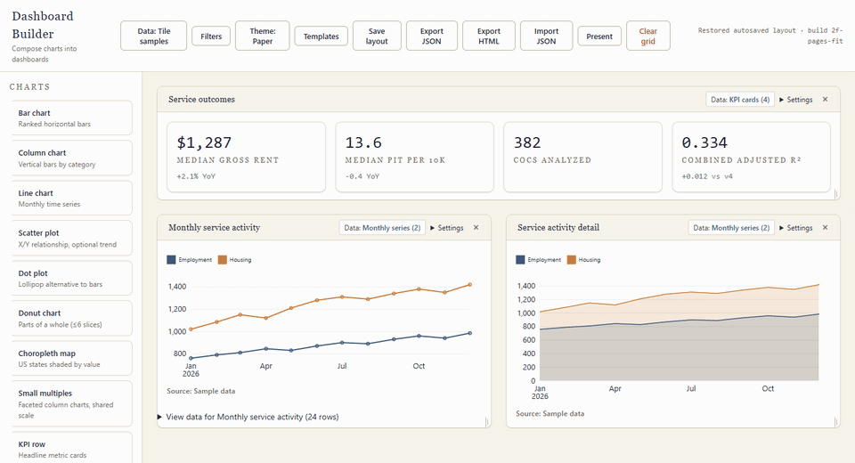

# Dashboard Builder

**A free, local-first dashboard composer.** Drag-and-drop grid, nine chart types, in-browser SQL, and one-click export to a self-contained HTML file. No account, no server, no subscription.

**[Open the live demo](https://nateriera.github.io/dashboard-builder/)**



[](LICENSE)
[](https://github.com/nateriera/dashboard-builder/actions)

## Features

- Drag-and-drop, resizable 12-column grid with content-aware tile sizing
- 9 chart types (bar, column, line, scatter + trend, dot, donut, choropleth, KPI, text) rendered with Observable Plot
- CSV/JSON upload processed locally — your data never leaves the browser — plus built-in sample datasets
- Guided upload summary with column-type and missing-value observations plus explainable chart suggestions
- In-browser SQL via DuckDB-WASM: query your uploads, apply results straight to tiles
- 4 themes, 6 starter templates, save/load dashboards as JSON
- Export to a single self-contained HTML file — email it or host it anywhere, no server needed
- Data-integrity guardrails: explicit binding modes, visible sampling notices, per-chart data tables

## Quick start

No install needed — open the **[live demo](https://nateriera.github.io/dashboard-builder/)** and start dragging. To run it locally:

```sh
npm ci
npm run dev
```

## Template gallery

Explore three original sample dashboards in the [starter template gallery](docs/template-gallery.md):

- **Executive overview** — KPIs, monthly trend, and category mix.
- **Trend deep dive** — time series, small multiples, and scatter.
- **Geographic snapshot** — state map with supporting metrics.

Choose **Templates** in the composer to try these or the other three starters.

## Start from an upload

Choose **Data** and upload a CSV or JSON file to see its row and column counts,
full-file missing-value counts, and inferred column types. Type inference uses
up to 5,000 evenly spaced rows; it is a suggestion, not a change to the source
data. The composer may offer a small set of charts when existing column-name
mapping rules can map the fields conservatively. Review, change field choices,
or uncheck suggestions before building. You can also set the upload as dashboard data or keep the
current dashboard. Profiling and chart suggestions run locally in the browser.

## Contributing

See [CONTRIBUTING.md](CONTRIBUTING.md) for setup, checks, and PR guidelines.
New contributors can browse [good first issues](https://github.com/nateriera/dashboard-builder/issues?q=is%3Aissue%20is%3Aopen%20label%3A%22good%20first%20issue%22).

## Development

### Run and verify

Use Node 24 (the verified test environment) and an installed desktop Google Chrome for browser tests.

```sh
npm ci
npm test
npm run build
npm run test:browser
npm run dev
```

The dev lifecycle builds the export template before starting Vite. Production
builds generate the template and composer together. Vite's runner config loader
avoids the Windows sandbox path traversal encountered with its bundling loader.
The browser suite starts its own local server at port 4173 and uses isolated
browser storage. Close any server on that port first.

The render sweep covers every registry renderer under all four themes (36 cases).
Focused tests cover data correctness, migration, precision, limits and serialized
queries; browser tests use real DuckDB-WASM, fault injection, fresh storage,
keyboard workflows and offline HTML. Evidence and scope are in
[the remediation report](docs/remediation-verification-2026-10-01.md).

## Architecture

### Data and chart contracts

Each tile's Data control offers samples, a mapped upload, SQL, or following the
dashboard default. Missing uploads, queries and SQL tables remain bound to their
original references. A blocking notice offers **Repair data binding**. Choosing
sample data is an explicit action; loading or exporting never substitutes it.

Charts use neutral axis labels until a user enters **X label / unit** or
**Y label / unit** under each tile’s **Settings**. These choices travel through autosave, JSON,
templates and HTML. Small-multiple columns use one zero-inclusive domain by
default; disabling Include zero displays a cropped-domain notice.

Donuts combine duplicate labels, sort by contribution and show the largest five
categories plus an explicitly labeled Other bucket when needed. Every
contribution remains in the total. Negative, nonfinite or zero-total inputs
produce a clear unsupported-data state. The eight-category sample totals 48,240.

Every chart has an expandable, paginated text table of its authoritative data.
Scatter and line plots with more than 2,000 rows show 2,000 evenly spaced rows
and a visible transformation notice. Their underlying rows remain in storage,
JSON, HTML and the text table. Trend lines on sampled scatter plots describe the
sample; use SQL aggregation when an authoritative statistical result is needed.
Bar/category charts refuse more than 100 rows rather than silently omit them.

### Layout schema and replacement

Layouts carry `app: "dashboard-builder"`, `version: 3`, `rowHeight: 24`, theme, dashboard default,
tile geometry, metadata and explicit binding modes:

```json
{
  "app": "dashboard-builder", "version": 3, "rowHeight": 24, "theme": "paper",
  "defaultDataset": { "kind": "samples" },
  "tiles": [{
    "id": "revenue", "type": "bar", "title": "Revenue", "source": "sales.csv",
    "dataset": "upload:sales", "binding": { "mode": "explicit", "ref": "upload:sales" },
    "sizing": "manual", "tileOptions": { "xLabel": "USD" }, "x": 0, "y": 0, "w": 6, "h": 15
  }]
}
```

A dashboard follower has `dataset: null` and `binding: {mode:"dashboard"}`.
An explicit sample, upload or query reference stays explicit even if it equals a
tile's sample default. Version 1 migrates without guessing: every existing
nonnull reference becomes explicit and missing/null references follow the
dashboard. V1 cannot recover historical intent, so it never converts a matching
sample reference into a follower. Validation clones its input; migration occurs
once and the next save is V3. V1/V2 geometry uses 72px rows; migration
multiplies y/h by three while preserving x/w and data bindings. V3 uses 24px
rows with gutters inside each cell, also used by HTML exports. Other versions
and row heights are rejected.

Manual resize intent is saved with the tile and survives data changes, reload,
import and present mode. **Settings → Fit content** chooses automatic sizing.
Plots redraw during pointer resizing and use both available width and height.
Very small manually sized tiles retain one outer scrolling fallback so labels,
source notes and data alternatives remain reachable.

Autosave remains at `dashboard-builder:layout:v1` for storage compatibility.
Imports validate the complete candidate before side effects: own registry types,
unique IDs, bounded finite integer geometry, themes, bindings, options, data,
queries, mappings and size budgets. Conflicting uploaded/query IDs are rejected.
Imports construct controls before persistence, write/read back datasets in one
IndexedDB transaction, and retain a recovery journal at
`dashboard-builder:layout:v1:recovery`. Construction or storage failure restores
the prior grid, queries and layout and rolls back only new import records.
Templates use the same schema validation and preserve chart options.

### Persistence and migration

Uploads live in IndexedDB `dashbuilder`, object store `datasets`; queries live
at `dashbuilder.queries.v1`. Data that cannot persist is labeled session only.
Export JSON provides a backup.

Legacy dataset keys `dashbuilder.datasets.v1` and `klaroDash.datasets.v1` remain
until every record has been written and read back from IndexedDB. Partial writes,
quota failures, unavailable storage and corrupt input retain the original source
and expose a retry action. The old `klaro-dashboard` database is retained after
copying. Failed migrations never claim durable persistence.

### SQL and portability

DuckDB tables use sample keys (`categorical`, `timeseries`, etc.) and
`upload_<id>`. Only one SELECT/WITH query is supported per run. Table
synchronization and execution share one serialized queue. A successful preview
is eligible to Apply only if its immutable SQL, request token and dataset revision
still match. Editing, starting/failing a run, discarding a result, or changing
datasets invalidates eligibility; mapping changes cannot bypass it. Results from
superseded revisions are rejected. Cache identity includes revision and field
contract, and becomes stale as soon as data changes.

Query dependencies conservatively include all registered uploads at Apply;
legacy queries with unknown dependencies include all registered uploads during
export. Arbitrary SQL is not parsed with a best-effort regular expression.
Export JSON includes eligible inputs, saved SQL and mappings. Missing/oversized
inputs and failed queries are listed before downloading; proceeding retains
broken references and an `omittedDependencies` list. Each dataset's inline
budget is 500 KiB. Portability therefore depends on carrying every dependency.

HTML export carries materialized query results, all tile rows, theme and options;
its viewer runs without SQL or network access. It rejects an export if the
dashboard changes during preparation. Errors remain visible per tile.

### Exact numbers and dates

Safe SQL integers become Numbers; larger integers become exact decimal strings.
KPI/text fields, IndexedDB and JSON preserve those strings. Numeric plotting
refuses integers outside the safe Number range. Make approximation explicit in
SQL (for example, rounding to a suitable unit) before plotting.

Currency/decimal values requiring exact display must be SQL CAST AS VARCHAR and
mapped to a KPI/text field. Arrow Decimal results require that cast, or an explicit
CAST AS DOUBLE for approximate plotting. Upload JSON must encode unsafe integers
as strings; numeric JSON integers already outside the safe range are rejected.

Date-only strings remain calendar dates. ISO timestamps with offsets and up to
millisecond precision can become line-chart dates. SQL timestamp epoch values
become UTC ISO strings; sub-millisecond values are refused with instructions to
CAST AS VARCHAR to preserve exact text. This is a millisecond Date contract,
not a claim of arbitrary timezone or fractional precision support.

### Budgets, keyboard and offline scope

Engineering limits are separate from measured device capacity:

| Resource | Limit / behavior |
| --- | --- |
| Upload | 16 MiB, 250,000 rows, 100 columns |
| SQL returned rows / columns | 10,000 / 100; add LIMIT or aggregate |
| Dense plotted marks | 2,000, with visible sampling notice |
| Category/KPI rows | 100, otherwise unsupported-data notice |
| Small-multiple facets | 12, otherwise filter/aggregate notice |
| Layout | 32 MiB, 100 tiles, twelve columns, max geometry 3,000 rows of 24px (same physical limit as legacy) |
| JSON inline data | 500 KiB per dataset; omitted dependencies listed |

Uploads parse in a worker, show progress, and can be cancelled. SQL runs in its
DuckDB worker with a running status. Discarding a running result prevents Apply;
it does not terminate the engine computation. Wait for execution to settle
before the next Run. Returned results are capped before JS materialization.

Core controls are keyboard operable; dialogs enter/trap/return focus and Escape
closes them. Chart tables provide text alternatives. The editor was verified in
Chrome viewport emulation at 320×740, 375×812, 768×1024, 1024×768, 1280×800 and
1440×900. Coverage includes phone chart creation and removal, tile editing,
data/table controls, save/export, viewport-contained drawers and popovers, and
desktop resize plus phone-first layout persistence. These are emulated
viewports, not physical-device acceptance. Screen-reader acceptance and other
browser engines remain unverified. The exported viewer has print rules that
keep each tile together and start a page per tile. Chrome print media is tested;
printer-specific output is unverified.

Uploaded data is processed locally. The composer loads application assets and
lazy DuckDB/WASM assets from its static host; HTML export fetches a generated
viewer template. These are runtime network requests. Downloaded HTML is tested
with browser networking disabled. Composer startup and first SQL use offline
are not promised; a cache hit is not a verified offline installation mode.

### Templates and release

Six original starter templates and user-saved templates retain theme and tile
options. Applying a template asks before replacing the dashboard. Templates
contain data references, so missing uploads/queries require repair in another
browser. Contributed templates must use original compositions rather than
recreate another creator's dashboard.

Production build output is `dist/`. Publishing, deployment and public release
remain separate owner-authorized actions.

## Stack and licenses

| Dependency | Version | License | Role |
|---|---|---|---|
| [gridstack](https://github.com/gridstack/gridstack.js) | 13.x | MIT | Drag/resize dashboard grid |
| [@observablehq/plot](https://github.com/observablehq/plot) | 0.6.x | ISC | Chart rendering |
| [d3-shape](https://github.com/d3/d3-shape) | 3.x | ISC | Donut arcs |
| [d3-interpolate](https://github.com/d3/d3-interpolate) | 3.x | ISC | Color ramps |
| [htl](https://github.com/observablehq/htl) | 0.3.x | ISC | HTML/SVG templating |
| [d3-dsv](https://github.com/d3-dsv) | 3.x | ISC | CSV parsing for uploads |
| [@duckdb/duckdb-wasm](https://github.com/duckdb/duckdb-wasm) | 1.32.0 | MIT | In-browser SQL, lazy-loaded |
| [topojson-client](https://github.com/topojson/topojson-client) | 3.x | ISC | TopoJSON → GeoJSON (choropleth) |
| [idb](https://github.com/jakearchibald/idb) | 8.x | ISC | IndexedDB wrapper (upload store) |
| [vite](https://vite.dev/) (dev) | 7.x | MIT | Build tooling |

This project itself is **MIT** (see `LICENSE`). Browser test tooling uses
`@playwright/test` and `fake-indexeddb`, both Apache-2.0 according to their
installed package metadata.
