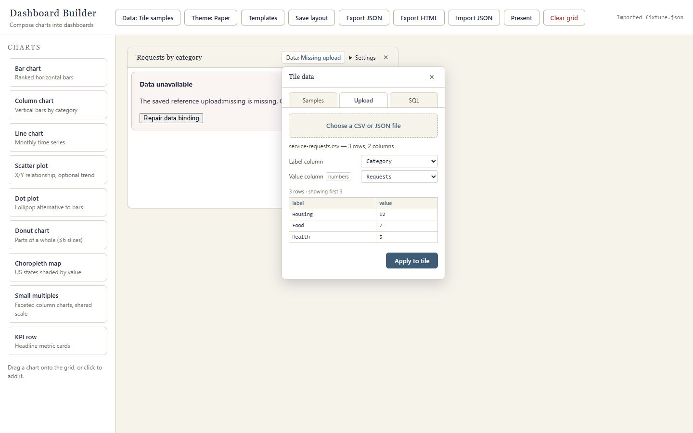
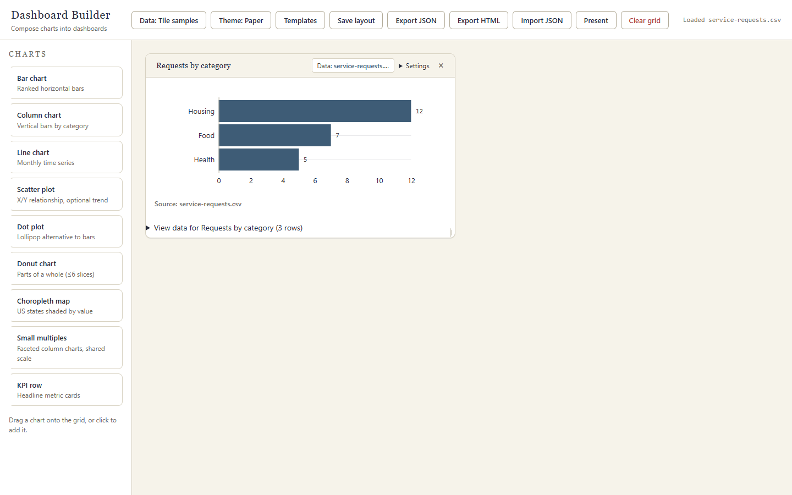

# Map a CSV to a chart

This walkthrough uses a synthetic CSV and the chart-level **Data** button. It
also shows how to repair a tile whose imported layout refers to an upload that
is no longer available.

## Prepare the file

Save this sample as `service-requests.csv`:

```csv
Category,Requests
Housing,12
Food,7
Health,5
```

## Bind the columns

1. In the composer, find a bar chart and choose its **Data** button. A tile
   showing **Data unavailable** can be repaired the same way.
2. Choose **Upload**, then choose `service-requests.csv`.
3. Set **Label column** to `Category` and **Value column** to `Requests`.
   Check the preview rows before continuing.
4. Choose **Apply to tile**. The chart now uses the uploaded rows.



After applying, the tile is bound to the new upload. This repairs the chart
without changing other tiles or silently substituting sample data.



## Keep the data portable

The upload is stored in this browser. Keep the original CSV if you need to
rebind it in another browser. **Export JSON** can inline an uploaded dataset up
to 500 KiB; larger or missing dependencies are listed before download. If you
continue with an omitted dependency, the JSON retains the broken reference and
records it in `omittedDependencies`.

**Export HTML** materializes the chart rows in a standalone viewer. The viewer
can be opened offline, but it is for viewing; use the composer to edit the
dashboard. See [JSON backup vs HTML sharing](json-backup-html-sharing.md) for
the differences.
