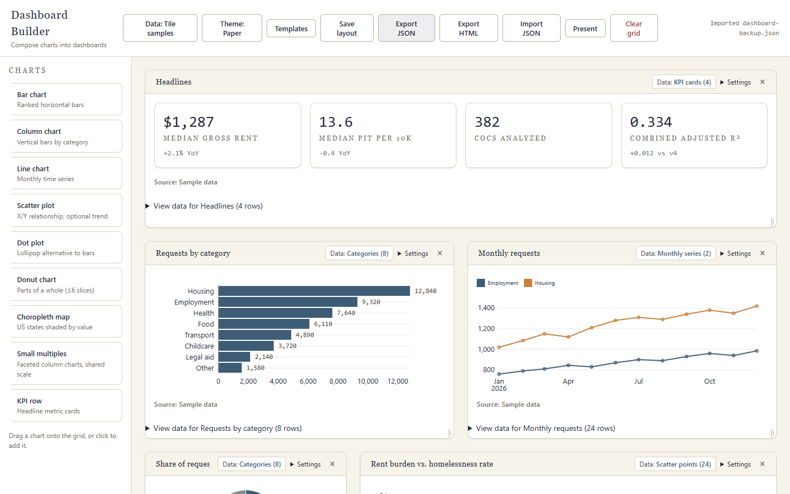
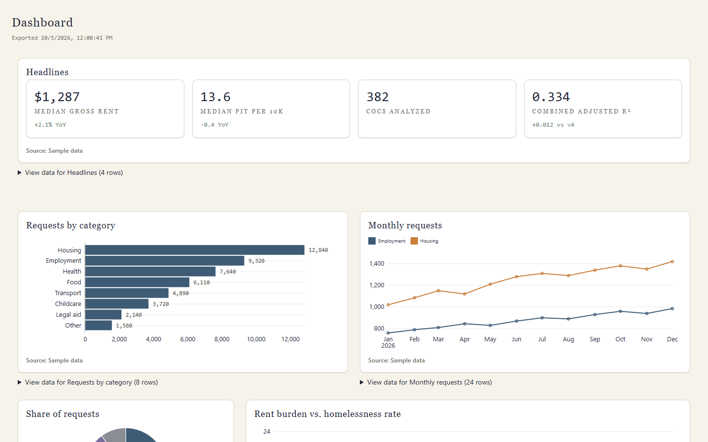

# JSON backup or HTML sharing?

Both exports use the current dashboard and bundled sample data. The screenshots
below were captured from the built-in starter dashboard.

| Export | Use it for | What it contains |
| --- | --- | --- |
| **Export JSON** | An editable backup to import into Dashboard Builder | Layout, bindings, options, saved SQL, and eligible uploaded inputs. Each upload has a 500 KiB inline budget. |
| **Export HTML** | Sharing a finished dashboard as a viewer | A single HTML file with materialized tile rows, theme, and options. It opens without the composer, SQL engine, or network access. |

## JSON backup details

Choose **Export JSON** to save a dashboard backup. To load it later, choose
**Import JSON** and select that file; the restored dashboard stays editable in
the composer. The screenshot above shows the built-in dashboard after loading
its backup. Built-in sample bindings remain references to the samples bundled
with the app. Uploaded datasets are included only when available and within
the per-dataset size budget. Before downloading, the app lists missing,
oversized, or failed-query dependencies. Continuing preserves those references
and records the omissions in `omittedDependencies`; an affected tile shows
**Data unavailable** after import.

To repair a missing upload, bind a replacement CSV through the tile’s **Data**
button. Follow [Map a CSV to a chart](csv-mapping-walkthrough.md).

## HTML sharing details

Use **Export HTML** for a portable viewer. The export materializes the rows for
each tile, so recipients do not need the source upload or SQL query to view the
charts. The HTML file is not an editable backup: it has no composer, SQL tab,
upload controls, or promise of offline composer startup. Keep a JSON backup as
well when you need to resume editing.
