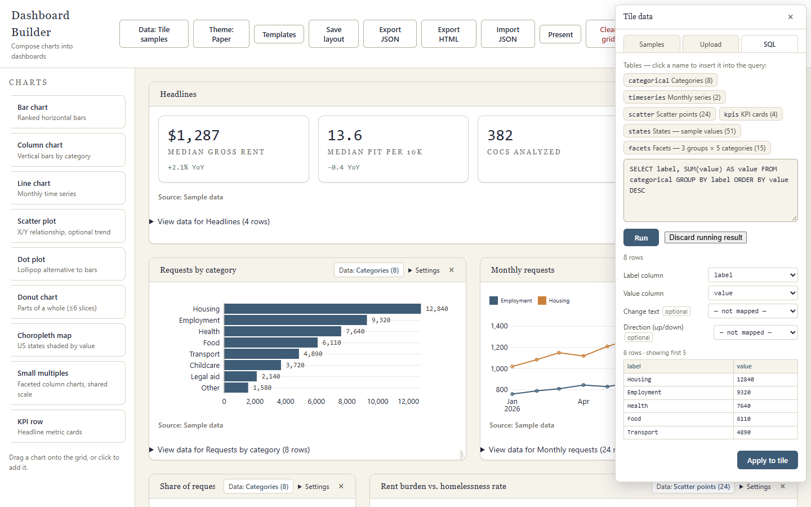

# Aggregate the built-in sample with SQL

This recipe uses the bundled `categorical` table and DuckDB-WASM in the browser.
It has no external service dependency. The first SQL use loads the bundled
in-browser database, which is about 39 MB.

## Run and apply the query

1. Open a tile’s **Data** button and choose **SQL**.
2. Replace the query with:

   ```sql
   SELECT label, SUM(value) AS value
   FROM categorical
   GROUP BY label
   ORDER BY value DESC
   ```

3. Choose **Run** and inspect the preview. This built-in table returns eight
   grouped rows.
4. Review the mapping: **Label column** → `label` and **Value column** →
   `value`. Choose **Apply to tile**.



Run creates a preview. If you edit the SQL after it runs, the preview is no
longer eligible to apply; run the edited query successfully again first.
Results are capped at 10,000 rows and 100 columns.

For exact SQL number behavior and supported casts, see the README’s
[Exact numbers and dates](../README.md#exact-numbers-and-dates) contract.
