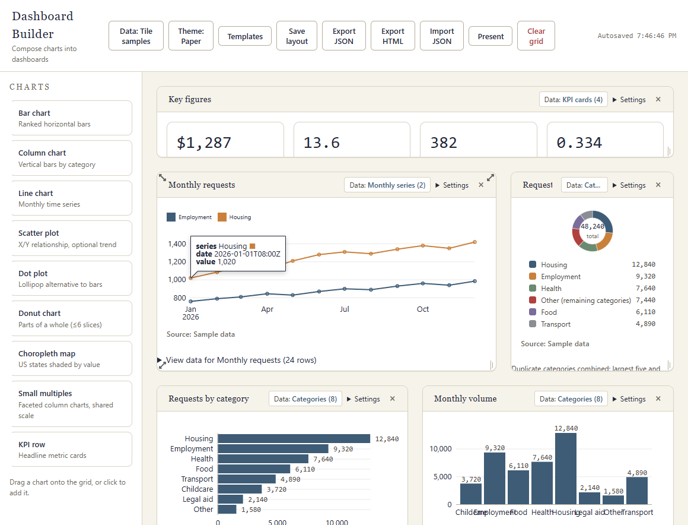
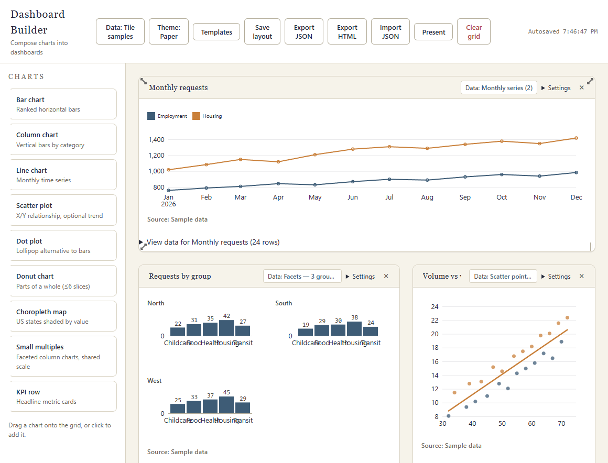
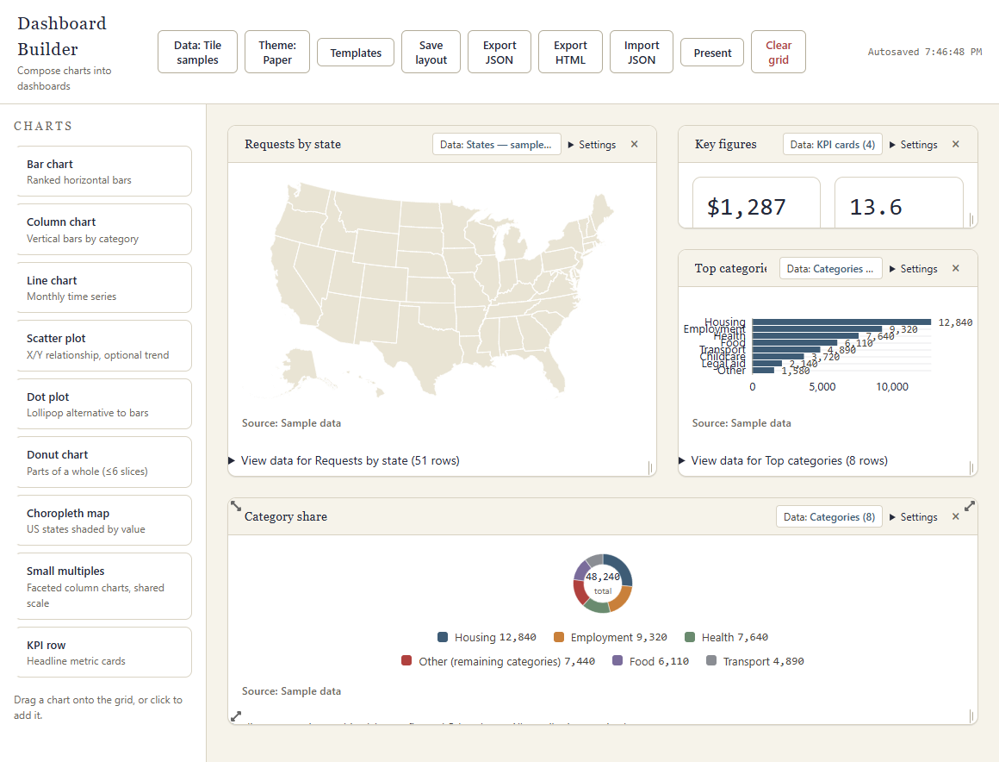

# Starter template gallery

Open [Dashboard Builder](https://nateriera.github.io/dashboard-builder/), choose
**Templates**, then select **Use** and confirm **Replace** for a starter below.
Replacement changes the current dashboard; export JSON first to keep a backup.
These original layouts use built-in sample data, not client records.

## Executive overview

KPI strip, monthly trend, category share, ranked categories, and monthly volume.
Use this as a starting point for a leadership summary.

## Trend deep dive

Monthly line chart, small multiples by group, and volume/value scatter plot.
Use this to explore one metric from several angles.

## Geographic snapshot

State map, key figures, category breakdown, and category share.
Use this for a geographic view with supporting detail.

All six starter definitions live in [src/templates.js](../src/templates.js).
The gallery shows a bundled screenshot for each starter. Custom saved
templates continue to use schematic previews so private chart contents are not
captured into an image.
Custom uploads and saved queries must travel with your dashboard to work in
another browser; missing data references require repair.
